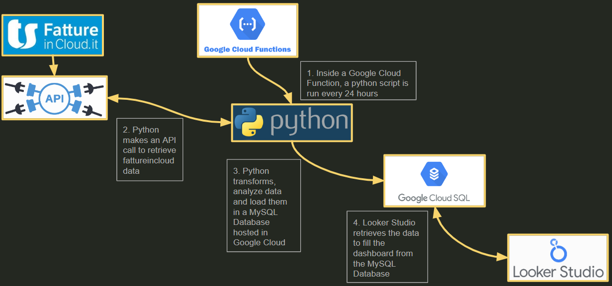

# Pedro Analytics: Comprehensive Business Intelligence Solution

Welcome to Pedro Analytics, your ultimate solution for automated analytics and business intelligence. Seamlessly integrated with FattureInCloud.it, Pedro Analytics delivers both basic and advanced analytics services, empowering you to make data-driven decisions effortlessly.

## Table of Contents

1. [Overview](#overview)
2. [Infrastructure](#infrastructure)
3. [Dashboard Tabs](#dashboard-tabs)
4. [Getting Started](#getting-started)
5. [Usage](#usage)
6. [Contact](#contact)

## Overview

Pedro Analytics is designed to provide comprehensive insights into your business operations. This dashboard is equipped with a variety of analytical tools and features, as highlighted below:

- **Automated data retrieval and processing**
- **Detailed revenue and expense analysis**
- **Advanced margin analysis by time and item**
- **AI-powered forecasting**
- **Customer segmentation and cohort analysis**

The goal of Pedro Analytics is to streamline your business intelligence processes and present data in an actionable format.

## Infrastructure

The following diagram provides a panoramic view of the Pedro Analytics infrastructure:



1. **Google Cloud Functions**: A Python script runs every 24 hours.
2. **API Call**: Python retrieves data from FattureInCloud.it via an API call.
3. **Data Transformation and Storage**: The data is transformed, analyzed, and loaded into a MySQL Database hosted on Google Cloud SQL.
4. **Data Visualization**: Looker Studio retrieves the data from the MySQL Database to fill the dashboard.

## Dashboard Tabs

The Pedro Analytics dashboard is divided into several tabs, each serving a specific purpose. Below are the tabs and their functionalities:

1. **Revenues Overview**
    - Provides an overview of your revenues.
    - [Documentation](#)

2. **Expenses Overview**
    - Summarizes your expenses.
    - [Documentation](#)

3. **Margin Analysis by Time**
    - Analyzes margins over different time periods.
    - [Documentation](#)

4. **Margin Analysis by Item**
    - Breaks down margin analysis by item.
    - [Documentation](#)

5. **Forecasts with AI**
    - Utilizes AI to forecast future trends.
    - [Documentation](#)

6. **Forecasts Simulator**
    - Allows simulation of different forecasting scenarios.
    - [Documentation](#)

7. **Customer Segmentation: RFM**
    - Segment customers using RFM analysis.
    - [Documentation](#)

8. **Customer Segmentation: Cohort Analysis**
    - Provides cohort analysis for customer segmentation.
    - [Documentation](#)

## Getting Started

To get started with Pedro Analytics, follow these steps:

1. **Clone the repository**:
    ```sh
    git clone https://github.com/your-username/pedro-analytics.git
    ```

2. **Install the required dependencies**:
    ```sh
    pip install -r requirements.txt
    ```

3. **Set up your environment variables** to connect to your FattureInCloud.it account and Google Cloud services.

4. **Run the Python script** to retrieve and process the data:
    ```sh
    python main.py
    ```

## Usage

Once set up, the data will be automatically retrieved, processed, and updated in the MySQL database every 24 hours. You can access the dashboard via Looker Studio to visualize the data and gain insights.

## Contact

For any questions or support, please contact:

- **Pedro Analytics Support**: [support@pedroanalytics.com](mailto:support@pedroanalytics.com)
- **GitHub Issues**: Feel free to open an issue on this repository for any bugs or feature requests.
